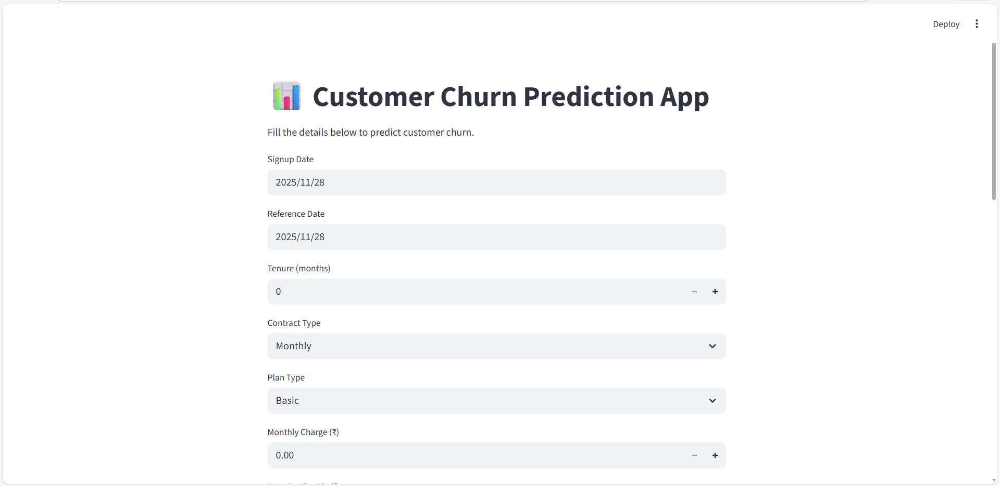
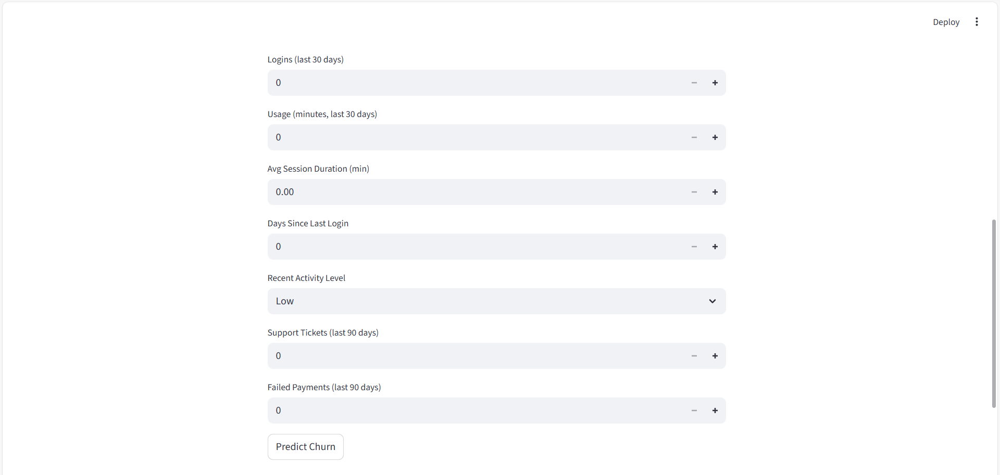
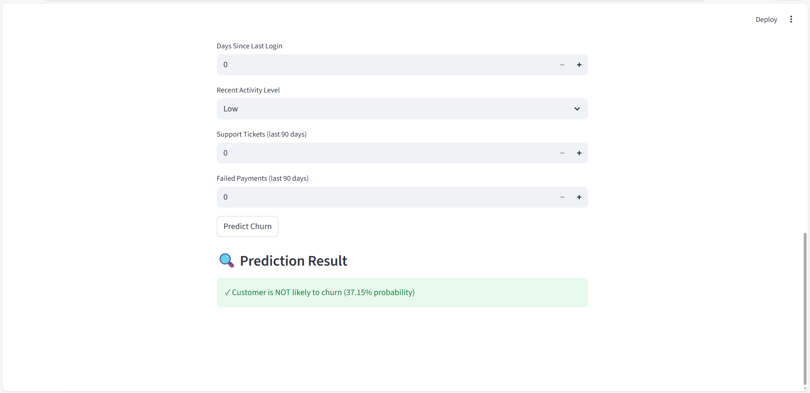

📘 README.md — Customer Churn Prediction Project
📊 Customer Churn Prediction

A machine learning project to predict whether a customer is likely to churn based on their usage behavior, subscription details, and engagement metrics.
This project includes data preprocessing, feature engineering, model training using a Random Forest classifier, and a fully functional Streamlit web application for real-time churn prediction.

🚀 Project Overview

Customer churn is one of the biggest challenges for subscription-based businesses.
This project predicts whether a customer will continue using the service or churn, allowing companies to take preventive action.

The project includes:

✔ Data preprocessing
✔ Feature engineering
✔ ML model training with a pipeline
✔ Streamlit-based front-end application
✔ OneHotEncoder + StandardScaler preprocessing
✔ Random Forest classifier
✔ Deployment-ready structure

📂 Project Structure
customer_churn_project/
│
├── data/
│   └── churn_dataset_10000.csv
│
├── models/
│   ├── churn_pipeline_random_forest.joblib
│   └── feature_names.json
│
├── app.py
├── 01_EDA.ipynb
├── 02_Model_Training.ipynb
└── README.md

🧠 Features Used in the Model

The following features were selected for the final model:

signup_date

reference_date

tenure_months

contract_type

plan_type

monthly_charge

auto_pay

has_discount

num_logins_30d

total_usage_30d_min

avg_session_length_min

days_since_last_login

recent_activity_flag

support_tickets_90d

failed_payments_90d

🚫 customer_id was removed because it does not contribute to prediction.

🛠️ Technologies Used

✔ Python
✔ Pandas
✔ NumPy
✔ Scikit-learn
✔ Streamlit
✔ Joblib
✔ OneHotEncoder
✔ StandardScaler
✔ RandomForestClassifier

🔧 How the Model Works
Preprocessing Pipeline:

Categorical features → OneHotEncoder

Numeric features → StandardScaler

Combined using → ColumnTransformer

Wrapped in a → Scikit-learn Pipeline

Model:

👉 RandomForestClassifier

n_estimators = 300

max_depth = 10

random_state = 42

Output:

✔ Churn prediction (Yes / No)
✔ Churn probability score

▶️ How to Run the Project Locally
1️⃣ Create a virtual environment
python -m venv .venv

2️⃣ Activate the environment

Windows:

.venv\Scripts\activate

Mac/Linux:

source .venv/bin/activate

3️⃣ Install required packages
pip install -r requirements.txt

If you don’t have a requirements file yet, run:

pip freeze > requirements.txt

4️⃣ Run Streamlit App
streamlit run app.py

🌐 Deploying the App

You can deploy using:

✔ Streamlit Cloud (Recommended)

Just upload your project to GitHub and connect it.

✔ Netlify (Landing Page only)

Use for a static landing page linked to your Streamlit app.

📈 Model Performance

A Random Forest model was used. Metrics include:

Accuracy

Precision

Recall

F1 score

Classification Report

(Values depend on dataset and training run)

---

## 📸 Application Screenshots

### 🏠 1. App Home Screen
This screen displays the title and the beginning of the input form used for churn prediction.

---

### 📝 2. Input Form Section
This section shows all the customer details that need to be filled in before predicting churn.

---

### 🔍 3. Prediction Output
After clicking **Predict Churn**, the app displays the churn result and the probability score.

---

🙌 Author

Sobiya Begum
Data Science & Data Analysis Enthusiast